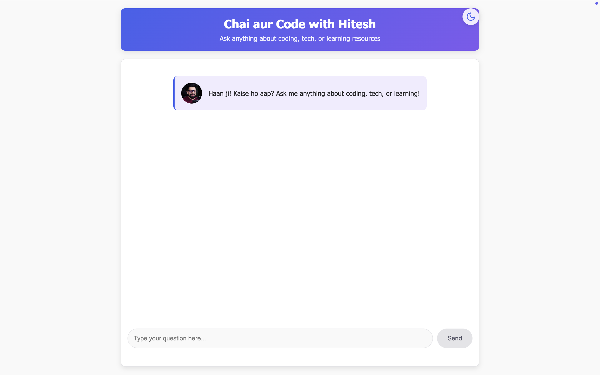

# 🧠 Hitesh Choudhary AI Persona — "Chai aur Code" Chatbot

This is a full-stack AI assistant that emulates the speaking style, personality, and technical knowledge of **Hitesh Choudhary**, a beloved tech educator and YouTuber. Users can chat with this AI to get coding help, learning roadmaps, or career guidance — all delivered in Hitesh's signature **Hinglish** tone.


## ✨ Features

- 🎤 AI persona trained to speak like Hitesh Choudhary (mix of Hindi + English)
- 🤖 Step-by-step reasoning before generating final answers
- 💬 Real-time chat UI with typing indicators and thinking animation
- 🧠 Backend powered by **Gemini 1.5 Flash**
- ⚛️ React frontend, Python Flask backend

## 🚀 Installation Guide

### 📦 Backend Setup (Flask + Gemini)

```bash
# Clone the repo and navigate to backend
git clone <your-repo-url>
cd backend

# Create a virtual environment
python -m venv venv
source venv/bin/activate  # Windows: venv\Scripts\activate

# Install Python dependencies
pip install -r requirements.txt

# Create a .env file with your Gemini API key
echo "GEMINI_API_KEY=your_google_gemini_api_key" > .env

# Start the Flask server
python persona_ai.py
```

### 🌐 Frontend Setup (React + Vite)

```bash
# Navigate to frontend
cd frontend

# Install dependencies
npm install

# Start the React dev server
npm run dev
```

## 📸 UI Overview

- **Welcome Screen**: Shows Hitesh-styled greeting if no messages
- **Thinking Process**: Displays typing animation while processing
- **Reasoning Flow**: Thought process bubbles are shown before AI gives a final response
- **Hinglish Magic**: Delivers responses in the signature Chai aur Code style




## 🔧 Technical Implementation

- **Flask Backend**: Handles API requests and Gemini model integration
- **React Frontend**: Modern UI with real-time chat capabilities
- **Gemini 1.5 Flash**: Powers the AI persona with natural language processing
- **Custom Prompt Engineering**: Carefully designed prompts to capture Hitesh's unique style

## 🙌 Credits

- Persona inspired by [Hitesh Choudhary](https://youtube.com/c/HiteshChoudharydotcom)
- Built using Google Gemini Flash, Flask, and React
- By devs, for learners — with chai ☕

## 📄 License

MIT License — Use it, remix it, chai ke sath enjoy karo ☕


